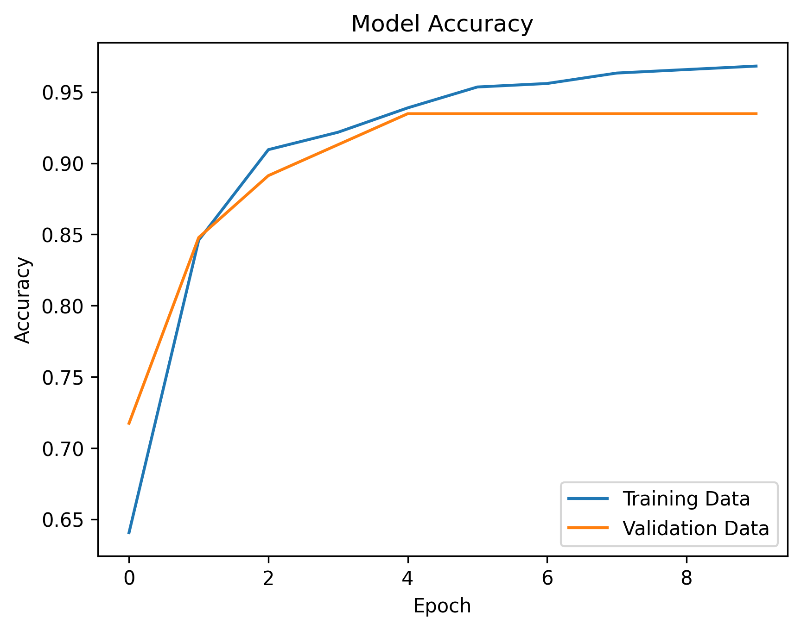
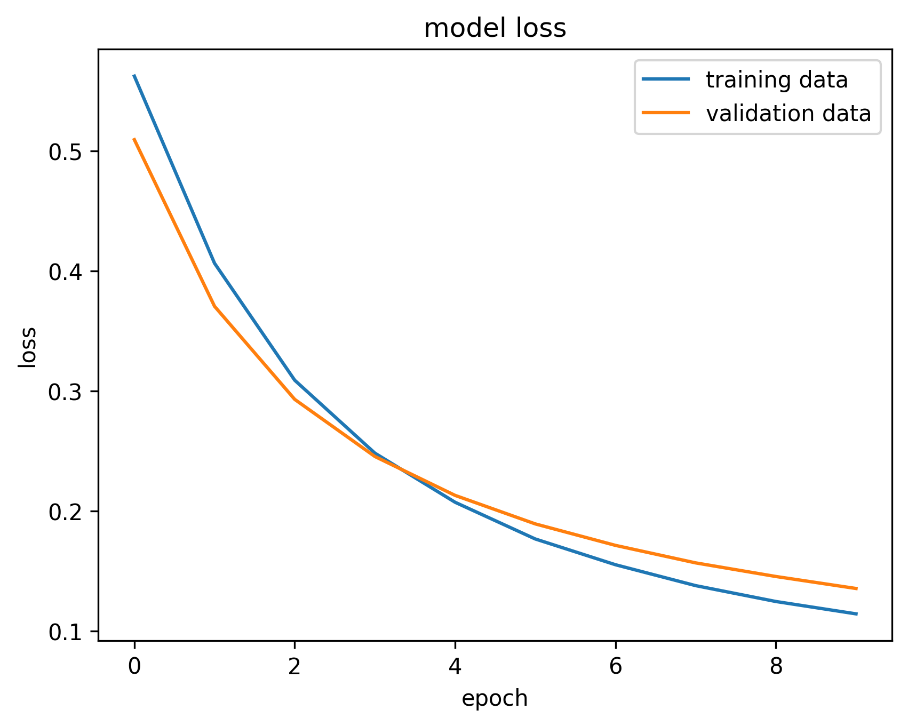
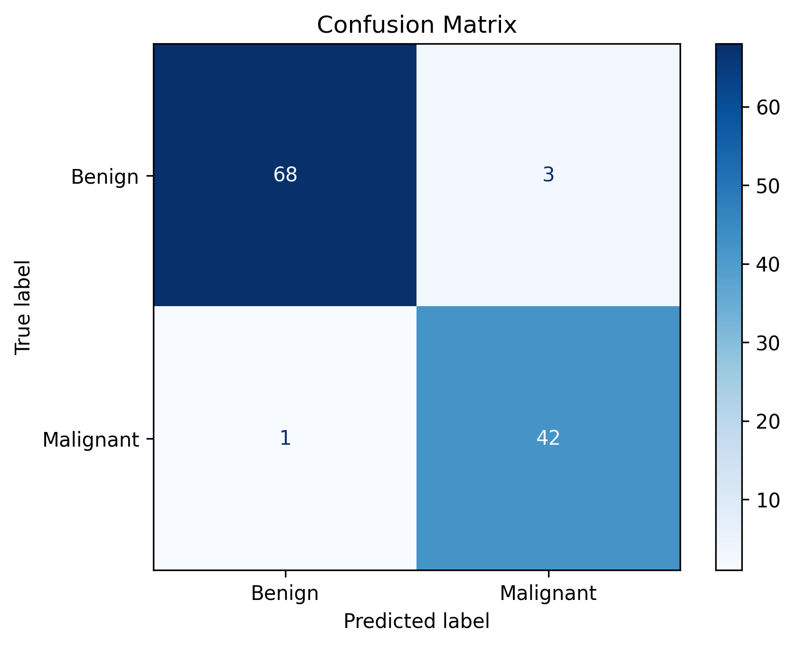

# Breast Cancer Classification Using TensorFlow

Built a deep learning project that classifies breast tumors as **Benign** or **Malignant** using a neural network built with TensorFlow and Keras. The model is trained on the Breast Cancer Wisconsin dataset and evaluated using accuracy, loss curves, and a confusion matrix.

---

## Features

- Data preprocessing with Pandas and Scikit-learn

- Feedforward Neural Network using TensorFlow/Keras

- Binary classification (Benign vs. Malignant)

- Training and validation accuracy/loss visualization

- Confusion matrix for model evaluation


---

## Technologies Used

- Python

- TensorFlow / Keras

- NumPy

- Pandas

- Matplotlib

- Scikit-learn

---

## Dataset

- Breast Cancer Wisconsin Dataset

- Features: 30 numerical features extracted from digitized images of breast masses.

- Target:

  - **0** → Benign

  - **1** → Malignant
    
---

## Model Architecture

- Input Layer: 30 features

- Hidden Layer: Dense (ReLU)

- Output Layer: Dense (Sigmoid)

- Optimizer: Adam

- Loss Function:   Sparse Categorical Crossentropy


---

## Results

### Training & Validation Accuracy



### Training & Validation Loss



### Confusion Matrix



The trained model achieved high classification accuracy with very few misclassifications on the test set.

---

## Installation

Clone the repository:

```bash

git clone https://github.com/khayal-ai/Breast-Cancer-Classification-TensorFlow.git 

```

Install the required packages:

```bash

pip install -r requirements.txt

```
Run the project:

```bash

python main.py

```
---

## Project Structure

```

Breast-Cancer-Classification-TensorFlow/

│

├── images/

│   ├── accuracy.png

│   ├── loss.png

│   └── confusion_matrix.png

├── data.csv

├── main.py

└── README.md

